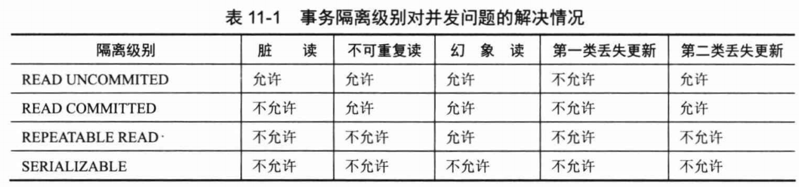

# spring mvc 复习项目
## web.xml
指定从xml文件中获取spring配置  
content-param -> contextConfigLocation  
> 指定xml文件资源地址    

指定从配置类中获取spring配置
content-param -> contextClass  
> 设置applicationContext为AnnotationConfigWebApplicationContext  
    
content-param -> contextConfigLocation  
> 指定配置类路径
#### IOC
##### Resource文件资源
Resource代表一个文件资源，根据不同实现可以分为ClassPathResource、FileSystemResource、UrlResource等。  
不同实现寻找文件的方式不同。  

使用ResourceLoader通过文件地址表达式和ant表达式来获取文件资源。  

**文件地址表达式：**
- classpath: -> ClassPathResource
- file: -> FileResource
- http:// -> UrlResource
- ftp:// -> UrlResource  

**ant表达式在文件地址表达式基础上可以使用通配符：**  
- ?  匹配一个字符，比如classpath:com/t?st.xml
- \* 匹配任意字符，比如classpath:com/*.xml
- ** 匹配路径下所有包含的字符 比如classpath:com/**/test.xml，com子目录及其子孙目录下的test.xml都会被找到。  

**tips: 读取文件内容时，尽量使用流的方式。以免在jar中无法使用getFile方法。**  

##### BeanFactory Bean工厂
**beanFactory**  
ResourcePatternResolver + DefaultListableBeanFactory获得BeanFactory  

```
ResourcePatternResolver resolver = new PathMatchingResourcePatternResolver();
Resource resource = resolver.getResource("classpath:beans.xml");
DefaultListableBeanFactory factory = new DefaultListableBeanFactory();
XmlBeanDefinitionReader reader = new XmlBeanDefinitionReader(factory);
reader.loadBeanDefinitions(resource);
```  

**ApplicationContext**  
ApplicationContext由beanFactory派生而来  
 
**BeanFactory中bean的生命周期(bean级别)：**  
- ② 构造函数
- ⑤ 设置bean的属性值
- setBeanName (实现BeanNameAware)
- setBeanFactory (实现BeanFactoryAware)
- afterPropertiesSet (实现InitializingBean)
- init (bean配置中指定init-method)
- destroy (实现DisposableBean)
- custom destroy (bean配置中指定destroy-method)  

**容器级别的生命周期**  

装载容器级别生命周期处理器，继承InstantiationAwareBeanPostProcessorAdapter和实现BeanPostProcessor  
- ① 在getBean之前会触发before Instance
- ③ bean实例化后会触发after instance
- ④ 在设置bean属性之前会触发property values
- 在bean的afterPropertiesSet之前触发before init，然后触发BeanPostProcessor的before init
- 在bean的afterPropertiesSet之后触发after init，然后触发BeanPostProcessor的after init
- 继续bean剩下的生命周期

> Spring中通常使用注解@PostConstruct和@Destroy来处理初始化和销毁这两个生命周期步骤，效果相同。 来自InitDestroyAnnotationBeanPostProcessor装配器 ApplicationContext默认装配  

**ApplicationContext中Bean的生命周期**  

在ApplicationContext中Bean的生命周期基本一致，context还提供ApplicationContextAware接口，可以获得applicationContext实例。setApplicationContext()

**bean的作用域：**  
- singleton 单例 (默认)
- prototype 每次获取都返回一个新实例
- request 在一次请求中存活
- session 在一个会话期间存活，不同会话使用不同的bean
- globalSession 在一个全局Session中共享  

**Spring加载配置创建Bean的流程，工作机制**  

ResourceLoader加载spring配置文件，得到表示spring配置文件的Resource。  
BeanDefinitionReader解析配置文件，每一个bean的信息会被解析成BeanDefinition对象，保存到BeanDefinitionRegistry中。  
BeanDefinitionRegistry对BeanDefinition进行加工，通过PropertyEditorRegistry注册自定义的属性编辑器。  
最后通过InstantiationStrategy和BeanWrapper来实例化Bean并设置Bean属性。  

**Spring的MessageResource**
MessageResource可以用于国际化。通过java的MessageFormat来格式化内容。  
ResourceBundleMessageSource是messageResource的标准实现，仅需要使用getMessage()方法来实现国际化。  
ReloadableResourceBundleMessageSource支持定时刷新资源文件，通过属性cacheSeconds来指定刷新周期，单位秒。  
ApplicationContext本身也实现了MessageResource接口，只需要注册一个MessageResource的Bean，context会自动加载这个bean到context本身，即可实现容器级别的国际化。  

**Spring的事件机制**  

事件ApplicationEvent  
- ApplicationContextEvent
    - ContextCloseEvent
    - ContextRefreshEvent
    - ContextStartEvent
    - ContextStopEvent
- RequestHandleEvent
    - ServletRequestHandleEvent
- 自定义事件，继承ApplicationEvent  

监听器ApplicationListener  

事件广播器ApplicationEventMulticaster，装配实现了ApplicationEventMulticaster的bean，即可实现自定义事件广播器。  

事件由容器统一管理，要产生事件，需要通过context.pushEvent(event)方法。
#### AOP

> jdk 动态代理是由jdk提供的, 它要求目标类必须实现接口才能为类创建代理，创建出来的代理是该实现接口的实现类。  

aop由切点和增强来描述在哪里进行aop和具体逻辑，一个完整的切面是包含了切点和增强信息的。  

**增强 Advice**  

增强负责具体的代码逻辑，包括前置增强、后置增强、环绕增强、异常增强和引介增强。  
顾名思义，可以知道不同增强实现类的作用。增强的具体实现类：  
- 前置增强 MethodBeforeAdvice Spring目前只支持方法级别的前置增强 
- 后置增强 AfterReturningAdvice
- 环绕增强 MethodInterceptor(org.aopalliance.intercept)综合实现了前置和后置增强的功能  
- 异常抛出增强 ThrowsAdvice
    > ThrowsAdvice 没有定义方法，通过约定的方式由具体实现类来提供afterThrowing方法。  

    > AfterThrowing的方法签名规定为  

    ```AfterThrowing (? super Throwable e) or (Method m, Object[] args, Object target, ? super Throwable e)```
  
    > 其他的签名则不合法，会报错。可以根据规则定义多个afterThrowing方法，实现根据不同的异常类型做出不同的处理。  
- 引介增强 IntroductionInterceptor  
> 引介增强可以为目标类创建新的方法和属性，实现一个新的接口。这种增强jdk代理无法实现，必须由cglib代理来实现。spring提供了DelegatingIntroductionInterceptor实现类，扩展该类来实现引介增强。  

增强本身就可以描述切点，即代理目标类所有方法。  

**切点 Pointcut**  
> Pointcut通过ClassFilter和MethodMatcher来描述和定位切点。包括静态方法匹配和动态方法匹配。业务开发中一般使用注解以及AspectJ表达式来匹配。  

- 静态方法切点 StaticMethodMatcherPointcut，子类NameMatchMethodPointcut和AbstractRegexpMethodPointcut
- 动态方法切点 DynamicMethodMatcherPointcut
- 注解切点 AnnotationMatchingPointcut
- AspectJ表达式切点 ExpressionPointcut
- 流程切点 ControlFlowPointcut 根据程序执行堆栈信息查看目标方法是否由某一个方法直接或间接发起调用来执行增强逻辑。
- 复合切点 ComposablePointcut 提供创建多个切点的操作类

**切面 Advisor**    
> Advice本身即可当作一个切面。但只有切点无法进行aop。Advisor描述切面，包括增强代码和切点信息。  

- Advisor 仅包含Advice
- PointcutAdvisor 包含了切点的切面，由Advice和Pointcut组成。
- IntroductionAdvisor 引介切面，作用于类层面，由ClassFilter定义。  

**PointcutAdvisor**  
- DefaultPointcutAdvisor 最常用的切面类型
- NameMatchMethodPointcutAdvisor 按方法名定义的切面
- RegexpMethodPointcutAdvisor 按正则表达式定义切点的切面
- StaticMethodMatcherPointcutAdvisor 静态方法定义切点的切面
- AspectJExpressionPointcutAdvisor 用于AspectJ表达式定义切点的切面
- AspectJPointcutAdvisor 用于AspectJ语法定义切点的切面  

Spring通过ProxyBean来生成aop代理类。  
```aidl
<!-- 目标类 -->
<bean id='target' class="Target" />
<!-- 增强 也可直接作为interceptorNames使用 -->
<bean id="myAdvice" class="Advice">
<!-- 切面 proxyTargetClass 启用cglib代理-->
<bean id='myAdvisor' class="Advisor" p:advice-ref="myAdvice">
<bean id="proxyBeanId" class="org.springframework.aop.framework.ProxyFactoryBean"
  p:interceptorNames="myAdvisor"
  p:target-ref="target"
  p:proxyTargetClass="true"
/>
```  
内部是使用ProxyFactory来生成代理对象的。  

```aidl
Object target = new Object();
BeforeAdvice advice = new CustomAdvice();
// Spring的ProxyFactory
ProxyFactory proxy = new ProxyFacotry();
proxy.setTarget(target);

//添加增强
proxy.addAdvice(...);
//添加切面
proxy.addAdvisor(...);

Object proxyObject = proxy.getProxy();
//do something
```  

**自动实现代理类**  

基于BeanPostProcessor容器级别处理器的自动代理实现类根据规则对匹配的Bean生成代理Bean实例。  
- BeanNameAutoProxyCreator 为特定名称规则的Bean创建代理
- DefaultAdvisorAutoProxyCreator 根据容器中所有Advisor，自动生成符合切面的Bean代理实例。
- AnnotationAwareAspectJAutoProxyCreator 为包含AspectJ注解的Bean自动创建代理实例。

**AspectJ**  
增强注解  
- @Before 前置增强
- @AfterReturning 后置增强
- @Around 环绕增强相当于MethodInterceptor
- AfterThrowing 异常抛出增强
- @After final增强，类似于try{}finally{}
- @@DeclareParents 引介增强  

切点织入顺序，在同一类中按定义顺序，不同类中按是否实现Ordered接口，没有实现则是不确定的。  

AspectJ底层是通过AspectJProxyFactory来创建代理对象的：  
```$xslt
AspectJProxyFactory apf = new AspectJProxyFactory();
// 设置目标对象
apf.setTarget();
// 添加切面
apf.addAspect([AspectJconfig].class);
// 获取代理对象
T obj = apf.getProxy();
```  

在Spring中可以通过配置的方式自动完成：  
```$xslt
<!-- 自动装配切面 -->
<bean class="AnnotationAwareAspectJAutoProxyCreator">
<!-- 或者使用aop提供的标签 与上面的方式效果相同 proxy-target-class控制是否强制使用cglib动态代理-->
<aop:aspectj-autofactory />
```  

**事务管理**  

事务隔离级别  

- READ UNCOMMITED 
- READ COMMITED
- REPEATABLE READ
- SERIALIZABLE   



事务传播机制  

- PROPAGATION_REQUIRED 没有事务则新建事务，否则加入到这个事务中
- PROPAGATION_SUPPORTS 支持当前事务，没有则以无事务方式运行
- PROPAGATION_MANDATORY 使用当前事务。没有事务则抛出异常
- PROPAGATION_REQUIRES_NEW 新建事务。如果存在事务，就把当前事务挂起
- PROPAGATION_NOT_SUPPORTED 以非事务方式运行。如果存在事务，就把当前事务挂起
- PROPAGATION_NEVER 以非事务方式运行。如果存在事务，则抛出异常
- PROPAGATION_NESTED 如果存在事务，则在嵌套事务内执行；没有事务则类似PROPAGATION_REQUIRED    

Spring中提供完善的事务管理机制。  
早期为Bean添加事务控制可以使用TransactionProxyFactoryBean来生成：
```$xslt
<bean id="target" class="TargetBean">
<!-- 各类orm框架提供的事务管理器-->
<bean id="txManager" class="..">
<!-- 生成事务代理bean 属性optimize启用cglib代理-->
<bean id="proxyBean" class="TransactionProxyFactoryBean" p:transactionManager-ref="txManager" p:target-ref="target">
<!-- 其他配置-->
    <property name="transactionAttributes">
        <props>
        <!-- 哪些方法可以被增强-->
            <!-- 只读 -->
            <prop key="get*">PROPAGATION_REQUIRED,readOnly</prop>
            <!-- 可写 -->
            <prop key="*">PROPAGATION_REQUIRED</prop>
        <props>
    </property>
</bean>
```  

新版本使用tx、aop标签：  
```$xslt
<!-- 通过AOP配置提供事务增强，让service包下所有Bean的所有方法拥有事务 -->
    <tx:advice id="txAdvice" transaction-manager="transactionManager">
        <tx:attributes>
            <tx:method name="*"/>
        </tx:attributes>
    </tx:advice>
    <aop:config proxy-target-class="true">
        <aop:pointcut id="serviceMethod"
                      expression="(execution(* service..*(..))) and (@annotation(org.springframework.transaction.annotation.Transactional))"/>
        <aop:advisor pointcut-ref="serviceMethod" advice-ref="txAdvice"/>
    </aop:config>
```  

使用注解：  
```$xslt
<!-- TransactionManager的id名为transsactionManager时，可以省略transaction-manager="transsactionManager" -->
<tx:annotation-driven transaction-manager="transsactionManager"/>
```  

**@Transactional注解：**

- propagation 事务传播行为 see Propagation.class
- isolation 事务隔离级别 see Isolation.class
- readOnly 事务读写性
- timeout 超时时间 单位秒
- rollbackFor 遇到时回滚的异常类型class数组
- rollbackForClassName 遇到时回滚的异常类型名称数组
- noRollbackFor 遇到时不回滚的异常类型class数组
- noRollbackForClassName 遇到时不回滚的异常类型名称数组
